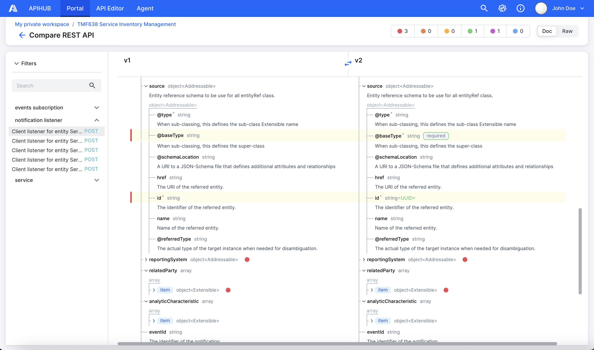
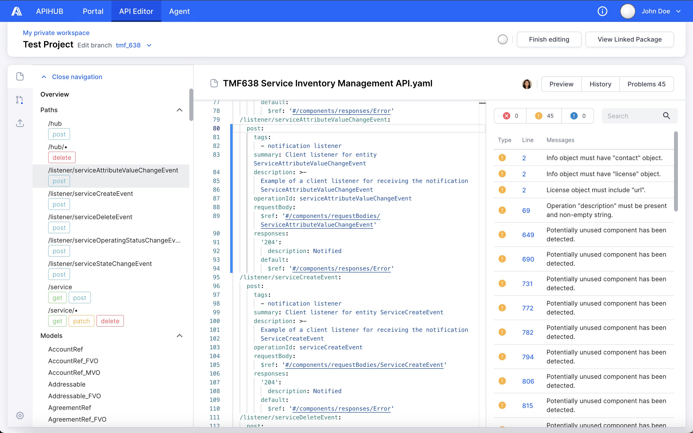
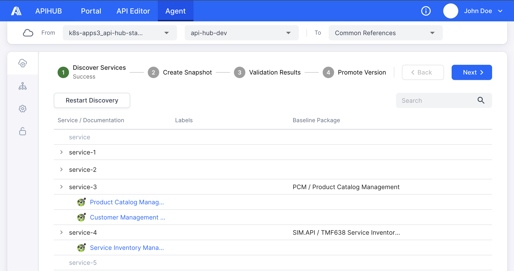

<picture>
  <source media="(prefers-color-scheme: dark)" srcset="./docs/img/dark_mode_icon.svg">
  
</picture>

# APIHUB UI

APIHUB is a comprehensive solution designed to achieve the following goals:
- Increase quality and completeness of API documentation.
- Provide a single point of truth for API documentation.
- Enable an API design-first approach.
- Automate API backward compatibility validation and integrate with CI process.

APIHUB consists of three main components:
- Portal
- Editor
- Agent

**Portal** is centralized repository for storing and managing API specification. Portal allows you to:
- Upload API specifications, markdown files and any other artifacts related to API.
- View API specifications and markdown files in human-readable format.
- Compare API.
- Check backward compatibility of API.
- Track deprecated entities from API specifications.

Currently, Portal allows working with OpenAPI specification with versions 2.0 and 3.0, and GraphQL specifications and introspections of release October 2021.

For more information about Portal, please see the [user guide](./docs/Portal%20User%20Guide.md).

**Editor** is a web-based IDE specifically designed for designing API documents. It offers a comprehensive set of features and tools to streamline the API design process and enhance collaboration among API designers, developers and stakeholders. Editor provides the following functionality:
 - Integration with GitLab.
 - Collaboration on API document editing.
 - Online validation for OpenAPI specifications.

 

**Agent** is web-based interface to work with a runtime agent. Runtime agent is an application that runs within the Kubernetes environment. It allows you to discover exposed API documentation endpoints from services running on Kubernetes. Additionally, Agent provides the ability to make snapshots of discovered API specifications, validate API changes and promote API to Portal.

 

For more information about Agent, please see the [user guide](./docs/Agent%20User%20Guide.md).
