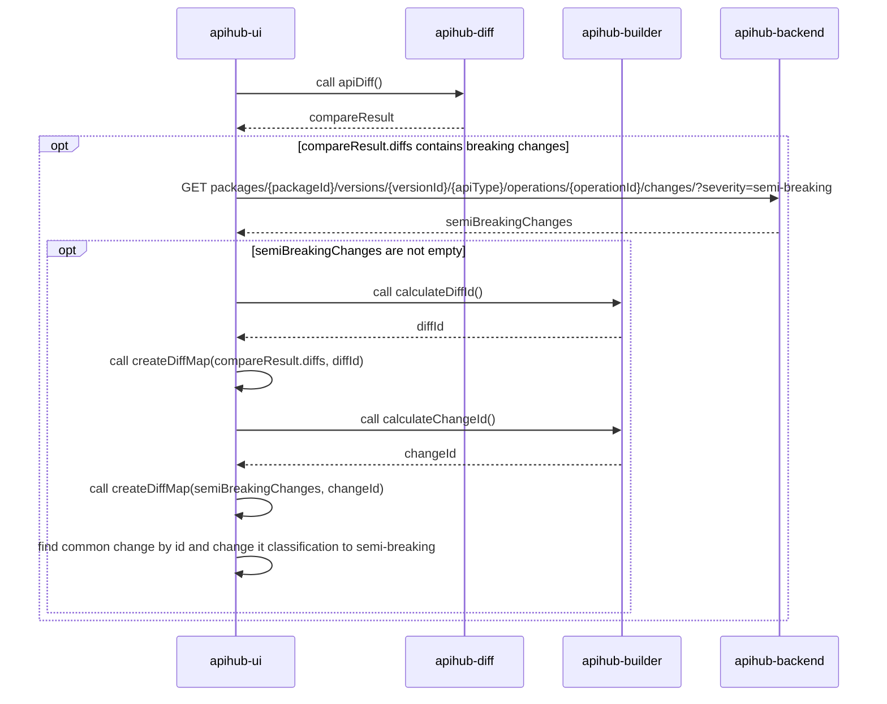

```mermaid
sequenceDiagram
    participant apihub-ui
    participant apihub-diff
    participant apihub-builder
    participant apihub-backend

    apihub-ui->>apihub-diff: call apiDiff()
    apihub-diff-->>apihub-ui: compareResult
    opt compareResult.diffs contains breaking changes
        apihub-ui->>apihub-backend: GET packages/{packageId}/versions/{versionId}/{apiType}/operations/{operationId}/changes/?severity=semi-breaking
        apihub-backend-->>apihub-ui: semiBreakingChanges
        opt semiBreakingChanges are not empty
            apihub-ui->>apihub-builder: call calculateDiffId()
            apihub-builder-->>apihub-ui: diffId
            apihub-ui->>apihub-ui: call createDiffMap(compareResult.diffs, diffId)
            apihub-ui->>apihub-builder: call calculateChangeId()
            apihub-builder-->>apihub-ui: changeId
            apihub-ui->>apihub-ui: call createDiffMap(semiBreakingChanges, changeId)
            apihub-ui->>apihub-ui: find common change by id and change it classification to semi-breaking
        end
    end
```
